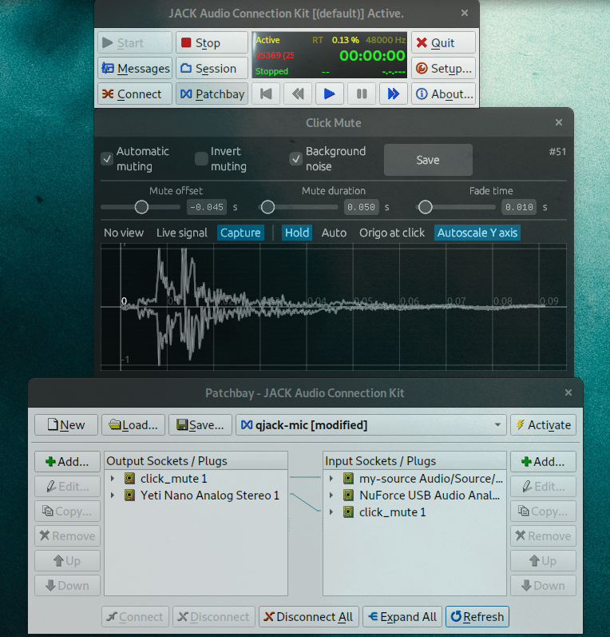

# Click Muter for Jack

Copyright Erkki Seppälä <erkki.seppala@vincit.fi> 2021

Licensed under the [MIT license](LICENSE.MIT).



A tool for helping with teleconferencing, when you have loud input
devices. Such as a mechanical keyboard..

It works by inputting a jack stream from microphone, and then directly
connecting all key-producing devices from /dev/input. Then when an
input arrives, its timing is checked and muting is applied for the
pre-configured duration. Finally the module outputs a jack stream that
can be used in place of the microphone.

But that's not all! Not only is it able to mute the clicks, it's also
able to unmute the clicks and mute everything else. With a click of a
button you can let your colleagues enjoy the sweet sounds of your
keyboard rig, while not being distracted by your other sounds, or
speech. Use the "Invert muting" function for this.

To work this of course needs a short delay. For me a 45-millisecond
buffer is enough, and Pipewire is configured with
`PIPEWIRE_LATENCY=128/48000`.

## Installation

If the Ubuntu 20.04 -based binary on the [GitHub releases
page](../../releases/latest/) works for you, maybe use that?
Otherwise:

1) 
```
sudo apt-get install ca-certificates curl file \
    build-essential autoconf automake autotools-dev \
	libtool xutils-dev libssl-dev git pkg-config \
	libncurses-dev
```

2) Install the Rust compiler with Cargo e.g. with https://rustup.rs/

3) `sudo apt-get install libglvnd-dev libxi-dev libjack-jackd2-dev`

4) `cargo install --git https://github.com/eras/ClickMuteJack`

5) `$HOME/.cargo/bin/click_mute` has now been installed

## Setting it up with Pipewire

1) create a source that is visible in the PulseAudio side:

```
pactl load-module module-null-sink                   \
                  media.class=Audio/Source/Virtual   \
                  sink_name=my-source                \
                  channel_map=front-left,front-right
```

2) Set up the `qjackctl` patchbay so that `click_mute` is connected
to `my-source` input and your microphone is connected to `click_mute`
input and activate the patchbay.

3) Set `my-source` as the default input in your audio control tool, such as
`pavucontrol`

4) Maybe restart your browser to re-enumerate audio devices; it seems
the `pactl` command does not cause a plug-in event to make it happen
automatically.

5) Boom, you can use https://online-voice-recorder.com/ to test if it
works.

If you just want to test (even more) locally, instead connect the
`click_mute` output directly to your speakers. Be aware that this can
cause an audio loop.

Results not satisfactory? Adjust the parameters `mute_offset_seconds`
and `mute_duration_seconds` in [`click_mute.rs`](src/click_mute.rs).

## Configuring

The current settings can be saved (as they are loaded) with the
Save-button to `click_mute.ini` in the XDG directory, so likely
`$HOME/.config/click_mute/`. However, if a `click_mute.ini` exists in
the current working directory, it will be used instead, for both
loading and saving. You can find the defaults from
[click_mute.ini.example](click_mute.ini.example).

You may change the configuration file to use with the `--config`
switch. `--help` works also.

### Parameters

`mute_offset`: number of seconds from the reception of the keyboard
event, to the time when we fade the microphone out. Due to delays
involved, this number can be negative. The default value is -0.045, so
45 milliseconds before the event, and it's a number that works on my
setup.

`mute_duration`: for how many seconds to mute the mic? 0.05, or 50
milliseconds, works for me.

`fade`: abruptly adjusting volume results in popping sound, so this
tells how many seconds to spend in fading in/out. A small value like
0.010 for 10 milliseconds is good.
